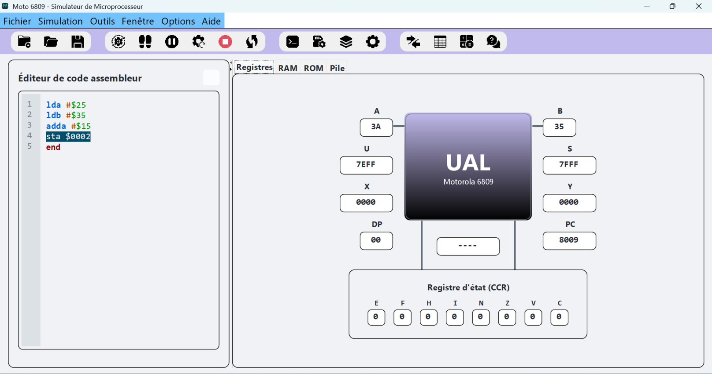

# Simulateur Motorola 6809

Simulateur du microprocesseur Motorola 6809 développé en Java
avec interface graphique Swing.

## Fonctionnalités
- Simulation des registres CPU (A, B, D, X, Y, U, S, PC, CC)
- Exécution pas à pas
- Visualisation de la mémoire RAM/ROM
- Interface graphique interactive

## Structure du projet
- src/main/java : code source Java
- src/main/resources : ressources graphiques (icônes, thèmes)
- theme.properties : fichier de configuration GUI

## Télécharger le simulateur

[JAR exécutable Moto6809](https://github.com/yacoubait/Moto6809-Simulator/releases/download/v1.0/Moto6809.jar)

## Exécution
```bash
java -jar Moto6809.jar
